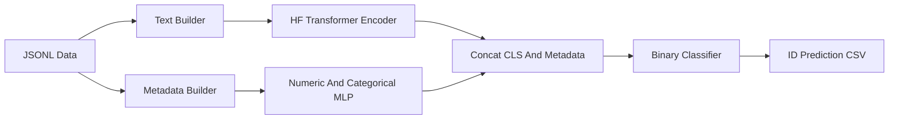

# HF 微调方案

## 目标与约束
- 任务来自 [`DL_Project_Instructions_2026.txt`](DL_Project_Instructions_2026.txt)：对每条 tweet 预测作者是 Influencer `1` 还是 Observer `0`，Kaggle 指标是 accuracy。
- 数据位于 [`Kaggle2025/train.jsonl`](Kaggle2025/train.jsonl) 和 [`Kaggle2025/kaggle_test.jsonl`](Kaggle2025/kaggle_test.jsonl)，训练集约 154,914 条，测试集约 103,380 条；提交文件需为 `ID,Prediction`，其中 `ID = challenge_id`。
- [`example.json`](example.json) 显示可用字段包括 tweet 正文、引用 tweet、hashtags/mentions/urls、source、reply/retweet/favorite/quote count、用户 profile 描述及计数类字段。

## 推荐主线
采用“三路特征融合”的 HF 微调模型：



- 文本输入：优先取 `extended_tweet.full_text`，否则取 `text`；拼接 `user.description`、`quoted_status` 正文和少量结构 token，例如 `[HASHTAGS] ... [SOURCE] Twitter for iPhone`。
- 结构化特征：保留 `retweet_count`、`favorite_count`、`reply_count`、`quote_count`、`is_quote_status`、`truncated`、hashtags/mentions/urls/media 数量、文本长度、emoji/URL/@/# 计数、`user.statuses_count`、`user.favourites_count`、`user.listed_count`、`user.default_profile`、`user.geo_enabled`、profile 是否有 `url/location/banner` 等。
- 预训练模型优先级：
  - 第一候选：`cardiffnlp/twitter-xlm-roberta-base`，对社媒文本鲁棒，适合 tweet 语域。
  - 第二候选：`FacebookAI/xlm-roberta-large`，算力够时作为强模型微调。
  - 第三候选：法语模型如 `camembert-base` / `camembert-large`，用于和 Twitter/XLM 模型做互补集成。

## 实验策略
- 先复现 baseline：保留现有 [`Kaggle2025/baseline.ipynb`](Kaggle2025/baseline.ipynb) 的 TF-IDF Logistic Regression 作为 sanity check，目标至少超过约 63%。
- 验证划分：使用 stratified 5-fold 或 stratified 90/10；因为数据中没有可用 user id，先按样本分层切分，并固定 seed：`42, 3407, 2026`。
- 训练配置建议：每张卡先按 80G 显存假定，使用 Hugging Face `accelerate` 启动；`max_length=256` 起步，large 模型可试 `384`；`lr=1e-5 ~ 3e-5`，`epochs=3~5`，`batch_size` 优先吃满显存，不够再用梯度累积，`weight_decay=0.01`，warmup 5%，bf16 优先、fp16 兜底。
- 泛化控制：early stopping、label smoothing 0.02、dropout 0.1~0.2、按 validation accuracy 保存 best checkpoint。
- 集成提交：对 3~5 个 fold、2~3 个模型输出概率取平均；阈值默认 0.5，也可在 validation 上调阈值后应用到 test。

## 代码落地结构
建议采用 `uv + pyproject.toml + main.py` 的单入口工程，方便复现和在多卡机器上反复调参：

- `pyproject.toml`：声明 Python 版本和依赖，核心依赖包括 `torch`、`transformers`、`accelerate`、`datasets`、`scikit-learn`、`pandas`、`numpy`、`tqdm`。
- `main.py`：唯一训练/评估入口，内部用 `argparse` 管理参数，用 `Accelerator` 包装 model、optimizer、dataloader 和 scheduler。
- `src/` 或 `code/` 辅助模块：后续可拆 `data.py`、`model.py`、`features.py`、`utils.py`，但外部调用始终走 `main.py`。
- `outputs/`：保存 checkpoint、训练状态、验证预测、测试预测和 submission。
- `README.md`：写清 `uv sync`、`uv run accelerate launch main.py ...`、恢复训练、评估和生成提交的命令。

`main.py` 的命令行至少支持这些参数：

```python
parser.add_argument('--load', type=str, help='Load checkpoint path')
parser.add_argument('--save', type=str, help='Save checkpoint path')
parser.add_argument('--target-train-iteration', type=int, help='Number of training epochs')
parser.add_argument('--eval', action='store_true', help='Evaluate on test set')
```

建议同时加入少量必要参数：`--train-path`、`--test-path`、`--model-name`、`--fold`、`--num-folds`、`--seed`、`--max-length`、`--batch-size`、`--lr`、`--weight-decay`、`--output-csv`、`--use-metadata`。

Checkpoint 设计：

- `--save` 指向目录时保存 `model`、`tokenizer`、optimizer、scheduler、random states、best validation accuracy、当前 epoch/iteration。
- `--load` 恢复时读取训练状态，继续从已完成轮数开始，直到累计达到 `--target-train-iteration`；例如已训练 2 轮、目标是 5，则只再训练 3 轮。
- 每次保存同步写 `trainer_state.json`，字段包括 `completed_train_iteration`、`global_step`、`best_metric`、`model_name`、`args`、`created_at`。
- `--eval` 模式只加载 checkpoint 并在 `kaggle_test.jsonl` 上输出 `ID,Prediction`，必要时也输出概率文件供 ensemble 使用。

典型命令：

```bash
uv sync
uv run accelerate launch main.py \
  --model-name cardiffnlp/twitter-xlm-roberta-base \
  --train-path Kaggle2025/train.jsonl \
  --test-path Kaggle2025/kaggle_test.jsonl \
  --save outputs/twitter-xlm-r-base-fold0 \
  --target-train-iteration 5 \
  --fold 0 \
  --num-folds 5 \
  --use-metadata

uv run accelerate launch main.py \
  --load outputs/twitter-xlm-r-base-fold0 \
  --save outputs/twitter-xlm-r-base-fold0 \
  --target-train-iteration 8

uv run accelerate launch main.py \
  --load outputs/twitter-xlm-r-base-fold0 \
  --eval \
  --output-csv outputs/submission_fold0.csv
```

## 交付与时间安排
- 第 1 阶段：数据解析和 baseline 复现，确认本地 validation 与 Kaggle sample submission 格式一致。
- 第 2 阶段：搭建 `pyproject.toml`、`uv` 环境和基于 `Accelerator` 的 `main.py`，确保 checkpoint 可恢复且训练轮数持久化。
- 第 3 阶段：微调 `twitter-xlm-roberta-base` 文本模型，得到第一版强提交。
- 第 4 阶段：加入 metadata fusion，并跑 5-fold 验证。
- 第 5 阶段：补 `xlm-roberta-large` / `camembert` 互补模型，做概率集成，选择 validation 和 Kaggle public 都稳定的版本作为 final。
- 第 6 阶段：整理 `code/`、`README`、实验表和 slides 说明，强调预训练模型来源、特征设计、调参策略、防过拟合和可复现性。
